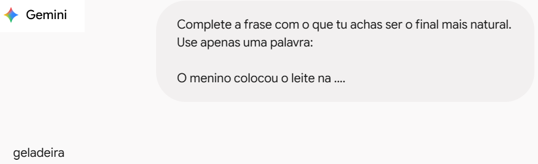
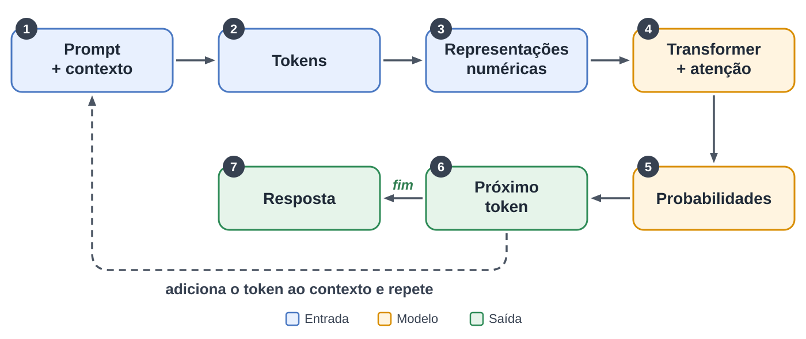
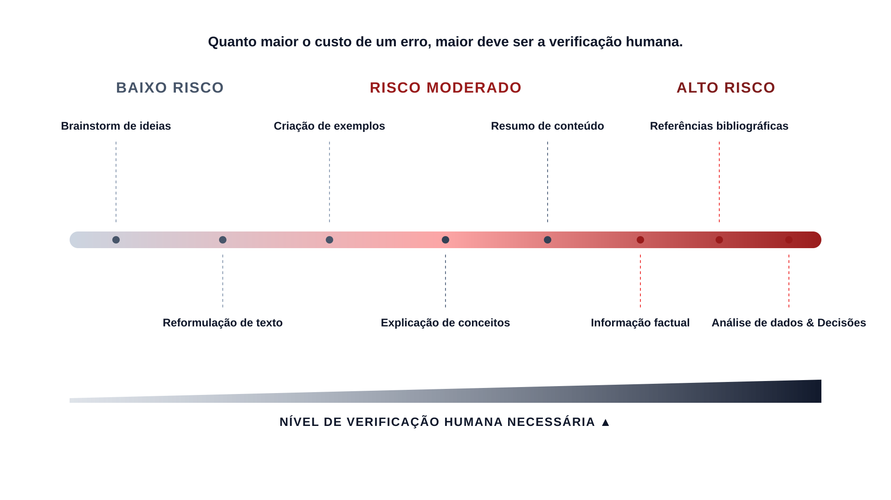
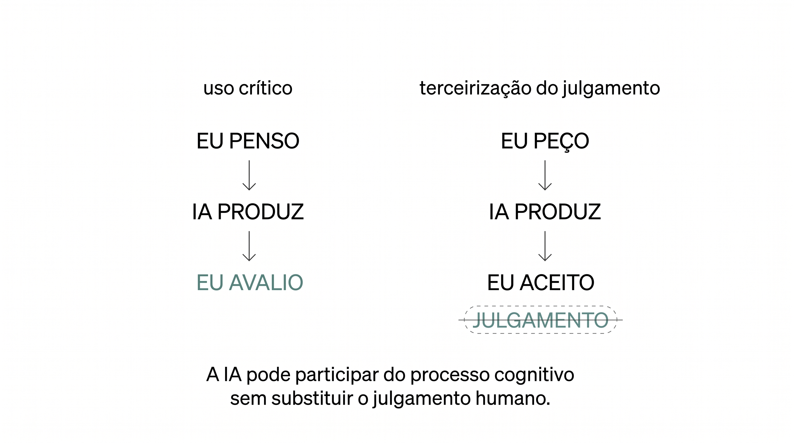
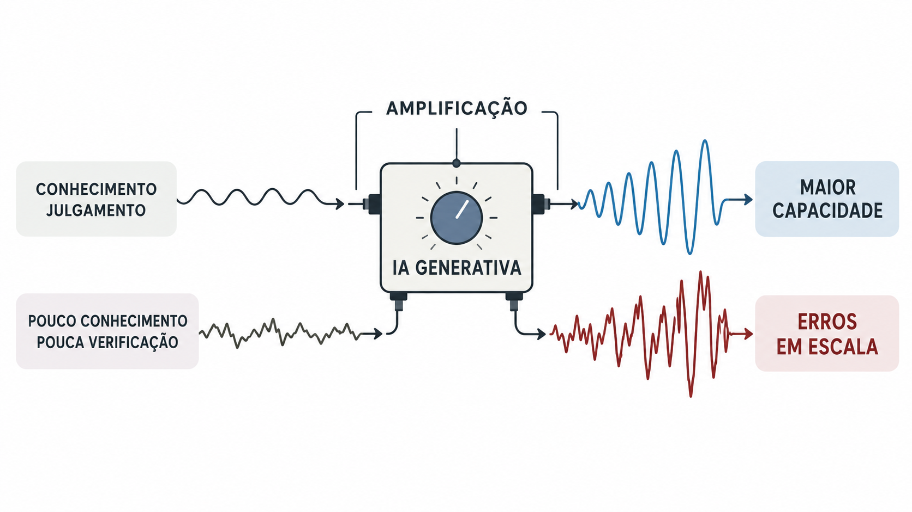

## Roteiro

::: {.notes}
- Não é "ser a favor" ou "contra"
- Conhecimento → julgamento
- 4 movimentos da palestra
- Primeiro entender; só depois decidir
:::

<br> 

**1. ENTENDER** <br>
<em>O que uma IA generativa </em><span class="renan-accent"><em>realmente faz?</em></span>


**2. INVESTIGAR** <br>
<em>O que há</em> <span class="renan-accent"><em>por trás</em></span> <em>de uma resposta gerada por IA?</em>


**3. QUESTIONAR** <br>
<em>Por que ela parece tão</em> <span class="renan-accent"><em>inteligente?</em>


**4. DECIDIR** <br>
<span class="renan-accent"><em>Como podemos usá-la</em></span> <em>para estudar, aprender, ensinar e pesquisar?</em>

<!-- Context section slide -->
# Para começar a conversa {.section-slide}

<!-- Context slide 1 -->
## Duas reações comuns à IA
::: {.notes}
- Duas reações, não caricaturas
- Ambas ocorrem antes de compreender a tecnologia
- Problema comum: decisão antes da compreensão
:::

:::: {.columns}

::: {.column width="50%"}

<span class="renan-accent"><strong>Adoção acrítica</strong></span>

> *Nem precisei ler todo o capítulo. O ChatGPT <mark>resumiu tudo</mark>, me deu os pontos principais. Agora é só estudar pelo resumo!* <br>
<br><br>
> *Criei meu plano de aula <mark>em minutos</mark>, só precisei copiar os exercícios e imprimir.*


:::

::: {.column width="50%"}

<span class="renan-accent-2"><strong>Rejeição acrítica</strong></span>

> *Ninguém pensa mais. A IA faz tudo. Isso vai acabar <mark>atrofiando o cérebro humano</mark>.* <br>
<br><br>
> *Plágio, informações erradas, competição desleal... <mark>não dá pra confiar na IA</mark> para coisas sérias.*

:::

::::


<!-- Context slide 2 -->
## Uma tecnologia revolucionária exige conhecimento

::: {.takeaway}

A IA generativa tem um potencial enorme para transformar
como **estudamos, ensinamos, aprendemos** e **pesquisamos**, mas seu uso começa por compreender

:::

<div class="ai-flow">

  <div class="ai-flow-box">O QUE É IA GENERATIVA</div>

  <div class="ai-flow-arrow">→</div>

  <div class="ai-flow-box">COMO FUNCIONA</div>

  <div class="ai-flow-arrow">→</div>

  <div class="ai-flow-box">O QUE PODE FAZER</div>

  <div class="ai-flow-arrow">→</div>

  <div class="ai-flow-box">ONDE ESTÃO<br>SEUS LIMITES</div>

</div>

<!-- Section slide for section "Entender" -->
# 1. ENTENDER {.section-slide}

::: {.small}

**ENTENDER** - INVESTIGAR - QUESTIONAR - DECIDIR

:::

<!-- Entender - slide 1 -->
## O que é IA *generativa*

IA generativa produz novo conteúdo a partir de padrões aprendidos.<br>
<br>

::::: columns
::: {.column width="50%"}
### Busca tradicional

pergunta → busca → resultados

::: {.small}
Palavras-chaves geram listas de conteúdos já existentes, que devem ser avaliados e escolhidos pelo humano. 

:::

:::

::: {.column width="50%"}
### IA generativa

contexto + prompt → embeddings + atenção → predição token a token → resposta sintetizada

::: {.small}
O modelo usa o contexto para gerar um texto inédito em tempo real, que sintetiza a resposta. 

:::

:::
:::::
<br>

<div style="text-align: right;">
Mas como isso realmente funciona?
</div>


<!-- Entender - slide 2 -->
## Experimento

::: {.notes}
- Nós não esperamos passivamente a próxima palavra.
- Vocês acabaram de fazer uma previsão.
:::
<br>

### Completem a frase: <br>

::: {.big}

<span class="fragment">O</span> 
<span class="fragment">menino</span> 
<span class="fragment">serviu</span> 
<span class="fragment">refrigerante</span> 
<span class="fragment">e</span> 
<span class="fragment">colocou</span> 
<span class="fragment">a</span> 
<span class="fragment">garrafa</span> 
<span class="fragment">na</span> 
<span class="fragment">__________.</span>

:::
<br><br>

::: {style="text-align: right;"}

::: {.incremental}

- <span class="renan-accent"><strong><em>mesa</em></strong></span>, <span class="renan-accent"><strong><em>geladeira</em></strong></span>, <span class="renan-accent"><em>cozinha</em></span>
- <span class="renan-accent-2"><em>estante</em></span>, <span class="renan-accent-2"><em>gaiola</em></span>

:::

:::

<!-- Entender: slide 3 -->
## Experimento *(agora, a vez da IA)*

### Completem a frase: <br>

::: {.big}

O menino colocou o leite na ______.

:::



<!-- Entender - slide 4 -->
## O que aconteceu?

::: {.big}
Previsão!

:::

Tanto o cérebro humano quanto a IA são muito bons em detectar padrões e fazer previsões.


<br>

::: {.callout-warning title="MAS CUIDADO:"}
::: {style="font-size: 120%;"}
Os mecanismos que humanos e IA usam nas suas previsões são **diferentes**.
:::
:::

<!-- Entender - slide 5 -->
## E não é só completar frases

. . .

A IA **explica**

::: {.small}
PROMPT: Explique em poucas palavras o que é o CaVG Integrando Conhecimentos

:::

::: {style="font-size: 80%;"}
> É o evento anual do Câmpus Visconde da Graça (IFSul) que integra ensino, pesquisa e extensão, com palestras, apresentação de trabalhos e atividades culturais. *(Claude)*

:::
. . . 

A IA **argumenta**

::: {.small}
PROMPT: Por que um evento assim é importante?

:::

::: {style="font-size: 80%;"}
> É relevante porque reúne ensino, pesquisa e extensão em um só espaço, dando visibilidade à produção dos estudantes e mostrando à comunidade o que o câmpus público faz. *(Claude)*

:::

<!-- Entender - slide 6 -->
## E não é só completar frases
::: {.notes}
É o tipo de comportamento que, entre humanos, associamos à inteligência.
:::

. . .

A IA **adapta**

::: {.small}
PROMPT: Adapte essa justificativa para alunos que acabaram de entrar no IFSUL

:::

::: {style="font-size: 80%;"}
> No Integrando Conhecimentos você vê o que os estudantes do IFSul produzem, conhece outras áreas do câmpus e descobre oportunidades como pesquisa e extensão, que podem ser o seu caminho daqui a alguns semestres. *(Claude)*

::: 

. . . 

A IA **conversa**

::: {.small}
PROMPT: Claude, esse é um evento que eu gostaria de participar?

:::

::: {style="font-size: 80%;"}
> Sim, e você já está convidado a palestrar sobre IA nele, então só falta confirmar as datas de 2026 com a organização. *(Claude)*

::: 

<!-- Entender - slide 7 -->
## E por que parece inteligente?
::: {.notes}
Quando uma coisa produz linguagem coerente, responde às nossas perguntas, adapta sua resposta e parece acompanhar uma conversa, nós naturalmente interpretamos isso como alguém que está entendendo.
:::
*Porque nós reconhecemos inteligência pelo comportamento.* <br>
<br>

Tendemos a ser "seduzidos" pelo o que a IA diz porque temos uma 

::: {.quote}
> "...predisposição a interpretar atos comunicativos como portadores de significado e intenção".

::: {.quote-source}
— Emily M. Bender
| University of Washington
:::

:::


<!-- Section slide for section "Investigar" -->
# 2. INVESTIGAR {.section-slide}


::: {.small}

ENTENDER - **INVESTIGAR** - QUESTIONAR - DECIDIR

:::

<!-- Investigar - slide 1 -->
## Como a IA generativa produz uma resposta
::: {.notes}
"Isso acontece muito rapidamente."
"O ponto fundamental é: o modelo calcula probabilidades para o próximo token."
"Escolhe um token."
"Adiciona esse token ao contexto."
"E calcula novamente."
"Isso acontece repetidamente até produzir a resposta."
:::

::: {.image-slide}



:::

```{r}
#| include: false

library(tidyverse)

dados <- read_csv(
  "data/llm_surprisal.csv",
  show_col_types = FALSE
)

stopifnot("surprisal" %in% names(dados))
```

<!-- Investigar - slide 2 -->
## E se pudéssemos ver essas probabilidades?
<span class="renan-accent-2">O menino serviu refrigerante e colocou a garrafa na _________.</span>
<br>

. . .

Aqui, usamos um LLM para calcular ***surprisal***.

::: {.columns}

::: {.column width="60%"}

::: {style="font-size: 120%"}

```{r}
#| echo: true
#| eval: false
llm <- causal_words_pred(
  x = dados$palavra,
  by = dados$frase,
  model = "pierreguillou/gpt2-small-portuguese",
  log.p = 1/2) 

# Modelo: GPT2-small Portuguese | 50.257 tokens
# 124 milhões de parâmetros | transformers: 12
# dimensões de embeddings: 768

dados <- dados %>% mutate(surprisal = as.numeric(llm))
```
:::

:::

::: {.column width="40%"}

::: {style="font-size: 170%"}
```{r}
dados %>% filter(posicao == 10)
```
::: 

:::

:::

::: {style="font-size: 85%;"}
::: {.callout-note}
SURPRISAL é um índice de imprevisibilidade da palavra, dado o contexto anterior. 
<mark>Quanto **maior** o valor</mark>, **menos esperada** a palavra é no contexto.
:::
:::

<!-- Investigar - slide 3 -->
## A previsão do modelo de IA

```{r}
#| echo: false
#| fig-width: 15
#| fig-height: 9.5

library(ggplot2)

ggplot(dados, aes(x = posicao, y = surprisal, group = frase)) +
  geom_line(linewidth = 0.8, alpha = 0.4, linetype = "dotted") +
  geom_point() +
  geom_text(aes(label = palavra), vjust = -1.2, size = 8, check_overlap = TRUE) +
  facet_wrap(~ frase, ncol = 1) +
  scale_x_continuous(breaks = dados$posicao) +
  ylim(0, 25) +
  theme_minimal()
```

::: {style="font-size: 80%;"}
::: {.callout-warning title="SURPRISAL:"}
Quanto maior o valor, menos esperada a palavra é nesse contexto.
:::
:::


<!-- Investigar - slide 4 -->

## Como um LLM processa o prompt


```{=html}
<video autoplay loop muted playsinline width="100%">
  <source src="images/Como-funciona-um-LLM.mp4" type="video/mp4">
</video>
```


<!-- Investigar - slide 5 -->
## A IA não vê palavras... {.code-output-slide}

```{r}
#| echo: false

embeddings <- c(0.545032, -0.021356, -0.293542,  0.480319, -2.129006, -0.688096,  0.128043,  0.410229,  0.597872,  0.896607,  0.625471,  0.669162,  1.193501,
 -0.532403,  0.012419,  1.311845, -0.581835,  0.252861, -0.286609, -0.377855,  1.451246, -1.442421,  0.673493, -0.6477  ,  0.644659, -1.333087,
  0.227558, -0.082238,  1.481615,  2.680157, -1.485089,  0.265468, -1.585097, -1.061569, -0.036955,  0.94922 ,  0.001181, -1.836964,  0.274044,
 -1.123144, -1.206746,  0.225444,  0.216965, -0.784059, -0.102478,  0.718371, -0.397516,  1.148771,  1.588512, -0.190415,  0.136512, -1.427917,
 -0.787305, -0.082044,  0.60081 , -0.586489,  0.25642 ,  0.7943  ,  0.545722, -0.98599 , -0.485092,  1.870728,  0.729477,  1.629149)

cat("Embeddings para REFRIGERANTE:\n")
print(embeddings)

```

::: {style="font-size: 80%;"}
::: {.callout-note title="EMBEDDINGS:"}
Representação numérica de palavras, frases ou outros trechos de texto em vetores, de modo que significados semelhantes fiquem próximos entre si no espaço vetorial que o modelo usa para processar a linguagem.
:::
:::

::: {.bottom-right}

Para a IA, <mark>tudo são números</mark>. E as previsões são **cálculos estatísticos**.

:::

<!-- Investigar - slide 6 -->
## Como a IA consegue gerar textos tão "humanos"? <br>
<br>

::: {.columns}

::: {.column width="50%"}

### `GPT2-small Portuguese:`

:::{.small}
- 50.257 tokens
- 124 milhões de parâmetros
- 12 camadas de transformers
- 768 dimensões de embeddings
:::

:::

::: {.column width="50%"}

### Nuvem de embeddings:

```{=html}
<video autoplay loop muted playsinline width="80%">
  <source src="images/pca-embeddings.mp4" type="video/mp4">
</video>
```


:::

:::

[Ou seja: uma capacidade absurda de previsão!]{.fragment .renan-accent-2}


<!-- Section slide for section "Questionar" -->
# 3. QUESTIONAR {.section-slide}

::: {.small}

ENTENDER - INVESTIGAR - **QUESTIONAR** - DECIDIR

:::

<!-- Questionar - slide 1 -->

## Uma resposta pode parecer perfeita
<br><br>
<span class="fragment">

</span> 

<!-- Questionar - slide 3 -->

## A IA pode estar <span class="renan-accent-2">errada</span> sem saber que está errada
<br>
O modelo é otimizado para produzir uma continuação provável e coerente — não para garantir que cada afirmação seja verdadeira. <br>
<br>

::: {style="font-size: 120%;"}

::: {.callout-note title=ALUCINAÇÃO}

::: {style="font-size: 120%;"}

Quando a IA gera uma informação incorreta ou inventada, mas a apresenta com total confiança, como se fosse verdadeira. <br>
<br>

:::

**Por que acontecem:**

- O modelo prevê a palavra mais provável, não a mais verdadeira;
- Ele não tem acesso a uma base de fatos verificados, só a padrões aprendidos no treinamento;
- Lacunas ou erros nos dados de treinamento podem gerar associações erradas;
- Perguntas ambíguas ou fora do que o modelo aprendeu aumentam a chance de erro.

:::

:::

<!-- Questionar - slide 4 -->
## A confiança da IA não é evidência
<br>

Modelos de IA podem reproduzir fielmente discurso humano de persuasão:
<br>


::: {style="padding-left: 40px;"}

  <span class="renan-accent">*A resposta é ...*</span>

  <span class="renan-accent">*Embora existam algumas controvérsias, a evidência disponível sugere ..."*</span>

  <span class="renan-accent">*Ótima pergunta, e aqui está um fato interessante que você não considerou: ..."*</span>
  
:::

:::{.big}

:::{.bottom-right}
<span class="renan-accent-2">A forma da resposta **não garante** a qualidade da informação.</span>
:::

:::

<!-- Questionar - slide 5 -->
## Então, como verificamos?

Para informações importantes, podemos fazer três movimentos:<br>
<br>

::: {.columns}

::: {.column width="33%"}
### Rastrear
:::{.small}
**De onde veio essa informação?**

- Há uma fonte identificável?
- A fonte realmente diz isso?
- A IA está citando uma fonte real?
:::
:::

::: {.column width="33%"}
### Confrontar
:::{.small}
**O que outras fontes dizem?**

- A informação aparece em fontes independentes?
- Há evidências que contradizem a resposta?
- A resposta depende de uma única fonte?
:::
:::

::: {.column width="33%"}
### Testar
:::{.small}
***Podemos verificar diretamente?***

- Fazer o cálculo.
- Consultar o documento original.
- Reproduzir a análise.
- Conferir os dados.
- Testar o código.
:::
:::

:::

<br>

:::{.big}
<span class="fragment">Quanto maior o custo de um erro,<br>maior deve ser o esforço de verificação.</span>
:::

<!-- Questionar - slide 6 -->
## A dura verdade:

::: {style="text-align: center; font-size: 220%; font-weight: 900; line-height: 1.3;"}
Pular a verificação<br>
não economiza tempo.<br>
<br>
<span style="color: #c0392b;">Só adia o erro.</span>
:::

<!-- Questionar - slide 7 -->

## Continuum de verificação {.hero-slide}



<!-- Section slide for section "DECIDIR" -->

# 4. DECIDIR {.section-slide}

::: {.small}
ENTENDER - INVESTIGAR - QUESTIONAR - **DECIDIR**
:::

<!-- Decidir - slide 1 -->

## Não é uma questão de usar ou não usar

```{r, fig.width=11, fig.height=7}
library(DiagrammeR)

grViz("
digraph {
  rankdir=LR;
  node [shape=box, style=rounded, fontname='Arial'];
  
  centro [label='Para que\ntarefa?', shape=box, style='rounded,filled', fillcolor='#E8F4F8', fontsize=14, fontweight='bold'];
  
  q1 [label='O que quero\nalcançar?', shape=box, style=rounded];
  q2 [label='O que a IA pode\nacrescentar?', shape=box, style=rounded];
  q3 [label='O que pode\ndar errado?', shape=box, style=rounded];
  q4 [label='Quanto preciso\nverificar?', shape=box, style=rounded];
  
  centro -> q1;
  centro -> q2;
  centro -> q3;
  centro -> q4;
  
  {rank=same; q1; q2; q3; q4}
}
")
```

:::{.small .renan-accent-2}
Uma mesma tecnologia pode ser excelente para uma tarefa e inadequada para outra.
:::

<!-- Decidir - slide 2 -->

## Antes de usar a IA, defina <span class="renan-accent"><strong>bem</strong></span> a tarefa {.table-slide} 
<br>

### Comece pelo problema, não pela ferramenta:

::: {.table-block}
| Preciso...                     | IA pode ser usada para...          |
|:-------------------------------|:-----------------------------------|
| entender um conceito           | explicar de diferentes maneiras    |
| gerar ideias                   | propor alternativas                |
| melhorar um texto              | sugerir reformulações              |
| explorar um problema           | levantar hipóteses/perguntas       |
| analisar dados                 | ajudar com interpretação           |

::: {.table-note}
Usar IA não é uma competência isolada; é uma decisão sobre alocação de trabalho.
:::

:::

<!-- Decidir - slide 3 -->

## O que vale a pena delegar?

A IA pode ter várias funções, mas uma delas <span class="renan-accent-2"><strong>compete ao humano</strong></span>.<br>
<br>

::: {.columns}

::: {.column width="24%"}
### GERAR
:::{.small}
**A IA cria possibilidades:**

- ideias
- exemplos
- alternativas
- perguntas
- rascunhos
:::
:::

::: {.column width="24%"}
### TRANSFORMAR
:::{.small}
**A IA trabalha em algo que já existe:**

- resumir
- reformular
- traduzir
- adaptar
- organizar
:::
:::

::: {.column width="24%"}
### ANALISAR
:::{.small}
***A IA ajuda na checagem:***

- Fazer o cálculo.
- Consultar o documento original.
- Reproduzir a análise.
- Conferir os dados.
- Testar o código.
:::
:::

::: {.column width="24%"}
### <span class="renan-accent-2">DECIDIR</span>
:::{.small}
***A aqui a responsabilidade [é do humano]{.underline}:***

- escolher
- avaliar
- interpretar
- aprovar
- assumir consequências
:::
:::

:::

<br>

::: {.callout-tip title="Ética e transparência"}
Registre o uso da IA em seus projetos. <br>
Você precisa ser capaz de relatar **qual IA** foi usada, **quando**, **para quê** e **de que maneira**.
:::


<!-- Decidir - slide 4 -->

## Todas as decisões são (e sempre devem ser) do humano

### Isso nos leva de volta ao nosso contínuo de tarefas e riscos:


<!-- Decidir - slide 5 -->

## Um exemplo: usar a IA para estudar
<br>

Estratégia 1

:::{.fragment}
[prompt:]{.smallcaps} `Resuma este artigo para mim.`<br>
[resultado:]{.smallcaps .renan-accent-2} menos esforço → menos contato direto com o texto 😐<br><br>
:::

Estratégia 2

:::{.fragment}
[prompt:]{.smallcaps} `Faça cinco perguntas para testar se eu entendi este artigo. Não dê as respostas.`<br>
[resultado:]{.smallcaps .renan-accent-2} IA como instrumento de prática → estudante continua pensando 😊
:::

<!-- Decidir - slide 6 -->

## O que muda quando terceirizamos uma atividade cognitiva?



<!-- Decidir - slide 6 -->

## A IA amplia a nossa capacidade

:::{.center}

:::

:::{.bottom-right .small .renan-muted}
(Imagem gerada com OpenAI ChatGPT.)
:::

<!-- ética -->
# Antes de concluirmos, uma questão fundamental:

## Não esqueçamos da ética!


| [RESPEITE AS REGRAS]{.renan-accent}

:::{.fragment}
| [nos estudos:]{.smallcaps}<br> Use IA **quando e como for permitido** pelo professor, disciplina ou instituição.<br><br> <br>
:::

| [SEJA TRANSPARENTE]{.renan-accent}

:::{.fragment}
| [em pesquisas, trabalhos, materiais e planos de aula:]{.smallcaps}<br> Declare **se, qual e para quê** uma IA foi utilizada.<br><br><br>
:::

| [ASSUMA A RESPONSABILIDADE]{.renan-accent}

:::{.fragment}
| **A IA pode participar do processo.**
| **A responsabilidade continua sendo nossa.**<br><br><br>
:::

:::{.fragment}

::: {.columns}

::: {.column width="40%"}
:::

::: {.column width="60%"}

::: {style="font-size: 85%;"}
::: {.callout-important title="Declaração de uso de IA" appearance="simple"}

A ferramenta de IA generativa *Claude (modelo Sonnet 5)* foi utilizada para revisão gramatical e ortográfica e para auxiliar na programação dos slides nos formatos `.qmd` e `.html`. A seleção, revisão e responsabilidade pelo conteúdo final são do autor.

:::

:::

:::

:::

:::

<!-- Section slide for section "FINAL" -->

# Então...{.section-slide}

## Qual inteligência?
<br>

:::{.fragment}
| **ENTENDA**

| A IA generativa **gera** respostas; não simplesmente recupera respostas prontas.<br><br><br>
:::

:::{.fragment}
| **INVESTIGUE**

| Uma resposta de IA tem um **processo de geração** por trás dela.<br><br><br>
:::

:::{.fragment}
| **QUESTIONE**

| **Fluência não é evidência**. Uma resposta convincente pode estar errada.<br><br><br>
:::

:::{.fragment}
| **DECIDA**

| Use IA de acordo com **a tarefa, o risco e o grau de supervisão necessário.**<br><br><br>
:::

:::{.fragment}
::: {style="font-size: 150%; font-weight: 1000;"}
[A tua!]{.bottom-right .big .renan-accent-2 }
:::
:::

## 

::: {style="font-size: 150%"}
::: {.big}

<span class="renan-accent">O papel da IA é **prever**.</span><br>
O teu é **pensar, julgar e agir.**

:::

:::

<br><br>

::: {.columns}

::: {.column width="68%"}

### 
[*Obrigado!*]{.big}

<br>

Prof. Dr. Renan Castro Ferreira<br>
[Universidade Federal de Pelotas]{.smallcaps}
<span class="small"><br>
✉ renan.ferreira@ufpel.edu.br<br>
🌐 renanferreira.phd.sh<br>
[@]{.renan-accent}renan.linguist
</span>

:::

::: {.column width="32%"}

### 

{width="67%"}

:::

:::
